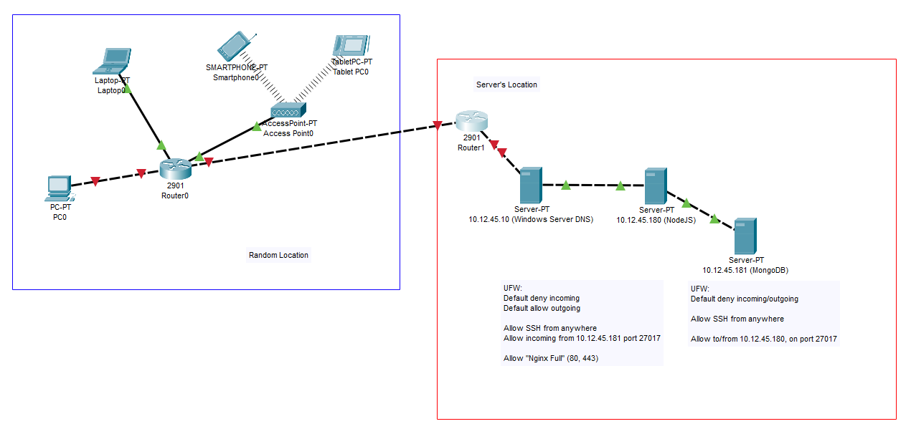

# Helpdesk Prove Eksamen

Spiceworks but worse

## ER Diagram


## Cisco Packet Tracer



## API Docs

### Authentication

- **POST** `/api/auth/login` - Logs in a user.
  - **Restrictions**: Cannot be accessed if the user is already logged in.
- **POST** `/api/auth/register` - Registers and logs in a user.
  - **Restrictions**: Cannot be accessed if the user is already logged in.
- **POST** `/api/auth/logout` - Destroys current session of the user.

### User Management

- **GET** `/api/org/users` - Retrieves a list of users in the organization.
  - **Restrictions**: User must be authenticated.
- **PUT** `/api/org/user` - Adds a new user to the organization.
  - **Restrictions**: User must be an organization admin.
- **DELETE** `/api/org/user/:userID` - Removes a user from the organization.
  - **Restrictions**: User must be an organization admin.
- **POST** `/api/org/toggle-admin` - Toggles a user's admin status.
  - **Restrictions**: User must be an organization admin.

### Profile

- **GET** `/api/profile/get` - Retrieves the current user's profile.
  - **Restrictions**: User must be authenticated.
- **POST** `/api/profile/create` - Creates a new profile for the user.
  - **Restrictions**: User must be authenticated.
- **PUT** `/api/profile/update` - Updates the user's profile.
  - **Restrictions**: User must be authenticated and have an existing profile.
- **DELETE** `/api/profile/delete` - Deletes the user's profile.
  - **Restrictions**: User must be authenticated and have an existing profile.

### Tickets

- **GET** `/api/ticket/list` - Retrieves a list of tickets.
  - **Restrictions**: User must belong to an organization.
- **POST** `/api/ticket/create` - Creates a new ticket.
  - **Restrictions**: User must belong to an organization.
- **POST** `/api/ticket/create-for-user` - Creates a ticket on behalf of another user.
  - **Restrictions**: User must be an admin.
- **GET** `/api/ticket/:ticketId` - Retrieves details of a specific ticket.
  - **Restrictions**: User must belong to the ticket's organization and either own the ticket, be assigned to it, or be an admin.
- **PUT** `/api/ticket/:ticketId` - Updates a ticket.
  - **Restrictions**: User must be an admin or support staff (`1st-line` or `2nd-line` roles).
- **DELETE** `/api/ticket/:ticketId` - Deletes a ticket.
  - **Restrictions**: User must be an admin.
- **POST** `/api/ticket/:ticketId/assign` - Assigns a ticket to a support staff member.
  - **Restrictions**: User must be an admin.

### Comments

- **POST** `/api/comment/:ticketId/add` - Adds a comment to a ticket.
  - **Restrictions**: User must belong to the ticket's organization and either own the ticket, be assigned to it, or be an admin.
- **GET** `/api/comment/:ticketId/list` - Retrieves comments for a ticket.
  - **Restrictions**: User must belong to the ticket's organization and either own the ticket, be assigned to it, or be an admin.

### Categories

- **GET** `/api/category/list` - Retrieves a list of ticket categories.
  - **Restrictions**: User must be authenticated.
- **POST** `/api/category/create` - Creates a new category.
  - **Restrictions**: User must be an admin.

### Professions

- **GET** `/api/profession/list` - Retrieves a list of professions.
  - **Restrictions**: User must be authenticated.
- **POST** `/api/profession/create` - Creates a new profession.
  - **Restrictions**: User must be an admin.

### Feedback

- **POST** `/api/feedback/:ticketId` - Submits feedback for a resolved ticket.
  - **Restrictions**: User must own the ticket.
- **GET** `/api/feedback/:ticketId` - Retrieves feedback for a specific ticket.
  - **Restrictions**: User must belong to the ticket's organization and either own the ticket, be assigned to it, or be an admin.

### Statistics

- **GET** `/api/ticket/stats` - Retrieves ticket statistics.
  - **Restrictions**: User must be an admin.

### Organization

- **POST** `/api/org/create` - Creates a new organization.
  - **Restrictions**: User must not already belong to an organization.

### Environment Variables

```env
# MongoDB Configuration
MONGO_PROD=false
MONGO_USER=
MONGO_PASS=
MONGO_HOST=localhost
MONGO_PORT=27017
MONGO_DB=helpdesk
MONGO_AUTH=

# Session Secret
SESSION_SECRET=VERYCOOLSECRET

# HTTP Configuration
HTTP_TYPE=http
PORT=3000
FRONTEND_URL=http://localhost:3000
```
